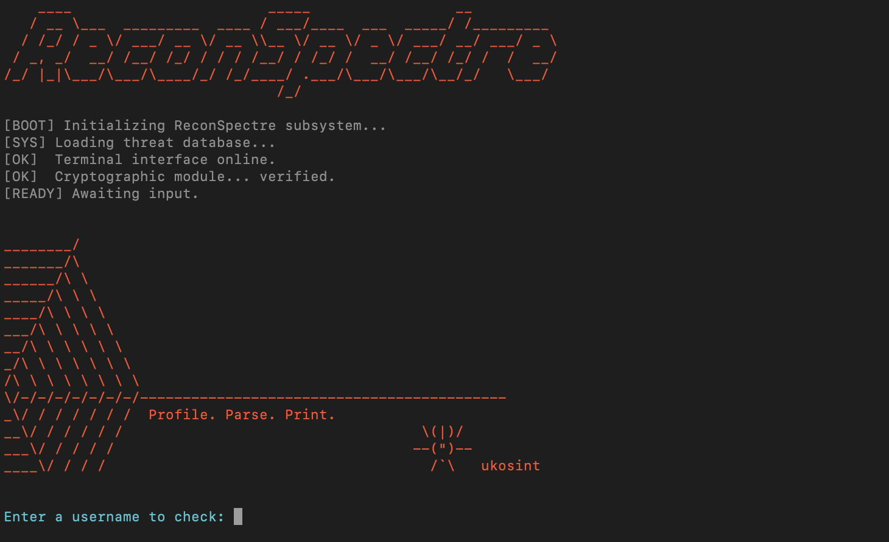

<p align="center">
  
</p>


# 👁️‍🗨️ ReconSpectre

**ReconSpectre** is a focused, lightweight OSINT tool for identifying usernames across a wide range of platforms — combining smart scanning, metadata scraping, and clean reporting.

Ideal for cybersecurity analysts, investigators, and digital researchers.

---

## 🚀 Features

- 🔍 Smart username scanning with common permutations:
  - `username`, `username_`, `username_official`
- 🌐 Supports 15+ platforms:
  - GitHub, Reddit, Instagram, Telegram, TikTok, Facebook, Keybase, and more
- 🎯 False positive filtering for high accuracy
- 📄 Auto-generated PDF reports with category grouping and icons
- 🧠 GitHub metadata scraping (followers, repos, creation date, etc.)
- 🎨 Terminal visual enhancements:
  - ASCII banner
  - Boot-up sequence animation
  - Custom signature block (ukosint)
- 📝 Results saved to `results.txt` and `username_report.pdf`
- 🛠️ Modular site config via `sites.json`

---

## 📸 Demo

  
*“Smart scan in style.”*

---

## 🛠️ Installation

```bash
git clone https://github.com/yourname/reconspectre.git
cd reconspectre
python3 -m venv venv
source venv/bin/activate
pip install -r requirements.txt
